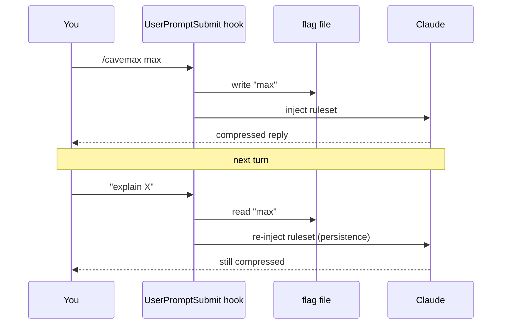

<div align="center">

# 🪓 CAVEMAX

**Hyper-compression mode for AI coding agents.**
Cut **~85–90%** of output tokens while keeping full technical accuracy —
on **Claude Code, Cursor, Gemini, and Codex**.

[](LICENSE)
[](#install)
[](#supported-tools)
[](#side-by-side-example)
[](#install)

</div>

---

CAVEMAX is the aggressive successor to [caveman](https://github.com/JuliusBrussee/caveman).
Same safety floor, pushed much further — **glyph notation + an abbreviation
dictionary + telegraphic syntax** — so answers stay correct but cost a fraction
of the tokens. One ruleset, installed into each tool's native rules format with a
single `npx` command.

```text
You:  /cavemax max
You:  Why is my /users endpoint slow?

AI:   `/users` slow ∵ N+1. per-user→+1 posts q. 100u=101q.
      fix: eager JOIN→1q · index FK · paginate.
```

## Table of contents

- [Why](#why)
- [Side-by-side example](#side-by-side-example)
- [Supported tools](#supported-tools)
- [Chat apps (no install)](#chat-apps-no-install)
- [Install](#install)
- [Usage](#usage)
- [Levels](#levels)
- [Accuracy floor — never compressed](#accuracy-floor--never-compressed)
- [How it works](#how-it-works)
- [Configuration](#configuration)
- [vs caveman](#vs-caveman)
- [FAQ](#faq)
- [Project layout](#project-layout)
- [Contributing](#contributing)
- [License](#license)

## Why

Long Claude Code sessions burn output tokens on filler: articles, pleasantries,
hedging, restated questions, and prose transitions that carry no information.
CAVEMAX strips all of it and encodes the rest densely, so you keep the same
technical content in a fifth of the space — longer sessions before context fills,
lower cost, faster reads.

The catch most "be terse" prompts hit is **drift**: the model slips back into
prose after a few turns. CAVEMAX fixes that with a per-turn reinforcement hook
(see [How it works](#how-it-works)) — the ruleset is re-injected on *every*
message, so the mode never fades.

## Side-by-side example

Prompt: *"Why is my `/users` endpoint slow and how do I fix it?"*

**Baseline (normal, verbose) — 535 chars / ~134 tokens:**
> Sure! Your `/users` endpoint is likely slow because of an N+1 query problem. For each user you fetch from the database, your code makes an additional separate query to load that user's posts. So if you have 100 users, you end up running 101 queries total, which is very inefficient. To fix this, you should use eager loading so all posts are fetched in a single query with a JOIN. You should also add a database index on the foreign key column to speed up lookups. Finally, consider adding pagination so you don't load all users at once.

**caveman full:**
> `/users` slow because N+1 query. Each user fetch makes extra query for posts. 100 users = 101 queries. Fix: eager load with JOIN (1 query). Add index on FK column. Add pagination.

**caveman ultra:**
> `/users` slow → N+1. Per user → extra posts query. 100 users = 101 queries. Fix: eager load JOIN → 1 query. Index FK. Paginate.

**cavemax max:**
> `/users` slow ∵ N+1. per-user→+1 posts q. 100u=101q. fix: eager JOIN→1q · index FK · paginate.

**cavemax brutal:**
> `/users` slow: N+1. /user→+1 posts q ∴ 100u=101q. fix: JOIN eager→1q · idx FK · paginate.

| variant | chars | ~tokens | saved |
|---|---:|---:|---:|
| baseline | 535 | 134 | — |
| caveman full | 177 | 44 | 67% |
| caveman ultra | 128 | 32 | 76% |
| **cavemax max** | **86** | **22** | **84%** |
| **cavemax brutal** | **81** | **20** | **85%** |

> `/users`, `JOIN`, `FK`, `N+1`, `101` stay **identical** across every variant —
> identifiers and numbers are never compressed. Short answers hit a hard floor
> (~84–85%); the full ~85–90% shows on longer explanatory text, where there is
> more redundancy (transitions, "you should", reformulations) to strip.

## Supported tools

One ruleset ([`skills/cavemax/SKILL.md`](skills/cavemax/SKILL.md)) is the single
source of truth. The installer renders it into each tool's native rules format.

| Tool | Installed as | Scope | Persistence |
|---|---|---|---|
| **Claude Code** | hooks + skill (`~/.cavemax`, registered in `settings.json`) | global | per-turn reinforcement hook |
| **Cursor** | `.cursor/rules/cavemax.mdc` (`alwaysApply: true`) | project | native (always applied) |
| **Gemini CLI** | `GEMINI.md` block | project or `~/.gemini` | native (always in context) |
| **Codex CLI** | `AGENTS.md` block | project or `~/.codex` | native (always in context) |

Only Claude Code supports the `/cavemax` slash command and statusline badge. In
Cursor/Gemini/Codex the rule is always on at `max`; switch in-conversation by
saying "cavemax safe", "cavemax brutal", or "normal mode".

### Chat apps (no install)

For **claude.ai, ChatGPT, and Gemini** chat: these have no files or hooks. Paste
the condensed CAVEMAX prompt once
into a persistent instructions field (Claude **Style** or preferences, ChatGPT
**Custom Instructions**, a Gemini **Gem**) and it applies to every chat.

➡️ **[Step-by-step chat tutorial](docs/INSTALL-CHAT.md)** ·
prompt in [`assets/cavemax-chat-prompt.md`](assets/cavemax-chat-prompt.md)

## Install

**Requirements:** [Node.js](https://nodejs.org) (any recent version — zero
dependencies) plus whichever AI tool you target.

### One command (recommended)

```bash
# install for every tool it can find (Claude global; Cursor/Gemini/Codex into the current project)
npx github:Nixus-security/Cavemax-Skills

# or pick tools explicitly
npx github:Nixus-security/Cavemax-Skills --cursor --gemini
npx github:Nixus-security/Cavemax-Skills --gemini --codex --global
```

Run it from the project directory you want the Cursor/Gemini/Codex rules written
into. Claude Code is always installed globally (its hooks live in `~/.cavemax` and
are registered in `~/.claude/settings.json`). The installer is **additive,
idempotent, and backs up** `settings.json` first. Restart your tool / session
afterward to load the rules.

> Default mode for Claude Code is **off** — it stays dormant until you run
> `/cavemax`. Cursor/Gemini/Codex apply the rule immediately (always-on at `max`).

### Uninstall

```bash
npx github:Nixus-security/Cavemax-Skills uninstall --all
```

<details>
<summary>From a clone (Claude Code only)</summary>

```bash
git clone https://github.com/Nixus-security/Cavemax-Skills.git
cd Cavemax-Skills
node scripts/install.js     # registers Claude Code hooks pointing at this folder
node scripts/uninstall.js   # removes them
```
</details>

<details>
<summary>Manual (no installer)</summary>

- **Cursor** — copy [`.cursor/rules/cavemax.mdc`](.cursor/rules/cavemax.mdc) into
  your project's `.cursor/rules/`.
- **Gemini** — paste the CAVEMAX block from [`GEMINI.md`](GEMINI.md) into your
  project `GEMINI.md` (or `~/.gemini/GEMINI.md`).
- **Codex** — paste the block from [`AGENTS.md`](AGENTS.md) into your project
  `AGENTS.md` (or `~/.codex/AGENTS.md`).
- **Claude Code** — add the two hooks + statusline to `~/.claude/settings.json`
  pointing at `src/hooks/` (see `scripts/install.js`).
</details>

## Usage

```text
/cavemax            # activate at the default level (max)
/cavemax safe       # switch level
/cavemax max
/cavemax brutal
stop cavemax        # back to normal prose  (also: "normal mode")
```

Natural language works too — "use cavemax mode", "max compression" — and the
active level shows in the statusline as `[CAVEMAX]` / `[CAVEMAX:BRUTAL]`.

> The `/cavemax` slash command and statusline are **Claude Code** features. In
> Cursor, Gemini, and Codex the rule is always on at `max`; to switch, just say
> "cavemax safe" / "cavemax brutal" / "normal mode" in the conversation.

## Levels

| Level | Savings | What it does | Use when |
|---|---|---|---|
| `safe` | ~70% | Drop articles/filler/pleasantries/hedging. Readable, fragments OK. | Ambiguity risk; sharing output with others |
| `max` | ~85–90% | + glyphs, abbreviation dictionary, telegraphic syntax (no subjects/pronouns/copulas), lists over prose. **Default.** | Day-to-day work |
| `brutal` | ~90%+ | + near-notation. Every non-load-bearing token stripped. Higher misread risk. | You want extreme density and can tolerate terseness |

## Accuracy floor — never compressed

Compression never costs correctness. These are always written in full, exact form:

- **Code blocks** — verbatim, untouched
- **Error strings** — quoted exactly
- **Identifiers** — function names, API names, file paths, commands, flags
- **Numbers, units, versions** — exact
- **Security warnings** — full prose
- **Irreversible-action confirmations** — `DROP`, delete, force-push, overwrite
- **Order-sensitive sequences** — where dropping conjunctions would flip meaning

When any of these apply, CAVEMAX automatically drops back to plain prose for that
part, then resumes.

## How it works

This describes the **Claude Code** path, which has the richest mechanism. Cursor,
Gemini, and Codex don't expose hooks, so there the ruleset is installed into their
native always-on rules file ([Supported tools](#supported-tools)) and the tool
keeps it in context every turn for free.

On Claude Code, CAVEMAX is three pieces: a **ruleset** (`SKILL.md`), two **hooks**,
and a **flag file** that records whether the mode is on and at which level.



1. **`SessionStart` → `cavemax-activate.js`** resolves the default mode. If `off`
   (the default), it stays silent. If active, it writes the flag file and injects
   the ruleset — filtered to just the active level, so the injection itself is small.
2. **`UserPromptSubmit` → `cavemax-tracker.js`** runs before every message. It
   parses your prompt for `/cavemax <level>` or natural-language switches, updates
   the flag file, then **re-injects** the rules. This per-turn reinforcement is
   what stops the model drifting back to prose.
3. **Flag file** (`~/.claude/.cavemax-active`) holds one whitelisted word
   (`safe` / `max` / `brutal`) or is absent (off). The statusline reads it to render
   the badge.

All flag I/O is **symlink-safe, size-capped, and whitelist-validated** — a local
attacker can't point the flag at a secret file and have its bytes rendered to your
terminal or injected into model context. See
[`src/hooks/cavemax-config.js`](src/hooks/cavemax-config.js).

`SKILL.md` is the single source of truth: the hooks read it at runtime, so editing
the ruleset there propagates everywhere with no duplication.

## Configuration

Set a persistent default level (so CAVEMAX is on from session start):

- **Environment variable:** `CAVEMAX_DEFAULT_MODE=max`
- **Config file:** `~/.config/cavemax/config.json` (or `%APPDATA%\cavemax\config.json`
  on Windows) → `{ "defaultMode": "max" }`

Resolution order: env var → config file → `off`.

## vs caveman

| | caveman | cavemax |
|---|---|---|
| Drop articles / filler / pleasantries | ✓ | ✓ |
| Drop subjects / pronouns (telegraphic) | partial (`ultra`) | ✓ by default |
| Glyph notation (`→ ∵ ∴ w/ ≈`) | partial | ✓ core |
| Abbreviation dictionary (prose words) | partial | ✓ core |
| Lists / tables over prose | — | ✓ |
| Per-turn anti-drift reinforcement | ✓ | ✓ |
| Accuracy floor (code/errors/security exact) | ✓ | ✓ |
| Token savings | ~70–75% | ~85–90% |

CAVEMAX is built independently and ships its own flag file, so it does not
interfere with a caveman install — but running both at once means two style
modes inject at once. Activate one at a time (`stop caveman` before `/cavemax`).

## FAQ

**Does compressing the output hurt answer quality?**
No. CAVEMAX changes *how* the answer is written, not *what* it contains. The
accuracy floor keeps code, errors, identifiers, and warnings exact.

**Will I be able to read `brutal` output?**
It's dense. `max` is the recommended daily driver; reach for `brutal` only when
you want maximum density and are comfortable with notation. Drop to `safe` when
sharing output with teammates.

**Does it compress my prompts or just the AI's replies?**
Only the replies — that's where the output tokens are. You type normally.

**Which tools are supported?**
Coding agents: Claude Code, Cursor, Gemini CLI, Codex CLI (see [Supported
tools](#supported-tools)) — any tool that reads `AGENTS.md` / `GEMINI.md` works
too. Chat apps: claude.ai, ChatGPT, Gemini via a pasted prompt — see the
[chat tutorial](docs/INSTALL-CHAT.md).

**Do I need to publish to npm?**
No. `npx github:Nixus-security/Cavemax-Skills` runs the installer straight from the
repo — no npm registry publish required.

**Can I use it alongside caveman?**
Yes, but turn one off at a time to avoid double style injection.

**How do I turn it off?**
Say `stop cavemax` (or `normal mode`) in a session, or run the uninstaller:
`npx github:Nixus-security/Cavemax-Skills uninstall --all`.

## Project layout

```text
skills/cavemax/SKILL.md         Source of truth — ruleset + decoding key + examples
bin/cavemax.js                  npx CLI — installs into Claude/Cursor/Gemini/Codex
lib/ruleset.js                  Renders SKILL.md into each tool's format (single source)
scripts/build-adapters.js       Regenerate the adapter files below from SKILL.md
scripts/install.js              Claude Code hook install from a clone
scripts/uninstall.js            Claude Code uninstall from a clone

AGENTS.md                       Codex / generic agents adapter (generated)
GEMINI.md                       Gemini CLI adapter (generated)
CLAUDE.md                       Claude Code context adapter (generated)
.cursor/rules/cavemax.mdc       Cursor rule, alwaysApply (generated)
assets/cavemax-chat-prompt.md   Condensed prompt for chat apps (generated)
docs/INSTALL-CHAT.md            Tutorial: claude.ai / ChatGPT / Gemini chat

.claude-plugin/plugin.json      Claude Code plugin manifest (hooks)
commands/cavemax.md             /cavemax slash command (Claude Code)
src/hooks/cavemax-config.js     Mode resolver + symlink-safe flag I/O
src/hooks/cavemax-activate.js   SessionStart: inject ruleset filtered to level
src/hooks/cavemax-tracker.js    UserPromptSubmit: switch level + per-turn reinforcement
src/hooks/cavemax-statusline.*  [CAVEMAX] badge (.ps1 + .sh)
```

Adapter files are generated — edit `skills/cavemax/SKILL.md` then run
`npm run build` to regenerate them.

## Contributing

Issues and PRs welcome. The ruleset lives entirely in
[`skills/cavemax/SKILL.md`](skills/cavemax/SKILL.md) — tweak compression behavior
there, then run `npm run build` to regenerate the per-tool adapter files. The
Claude Code hooks read `SKILL.md` at runtime. Please keep the [accuracy
floor](#accuracy-floor--never-compressed) intact: no change should let code,
error strings, or security warnings get compressed.

## License

[MIT](LICENSE) © 2026 Nixus-security

Inspired by and compatible with [caveman](https://github.com/JuliusBrussee/caveman)
by Julius Brussee.
