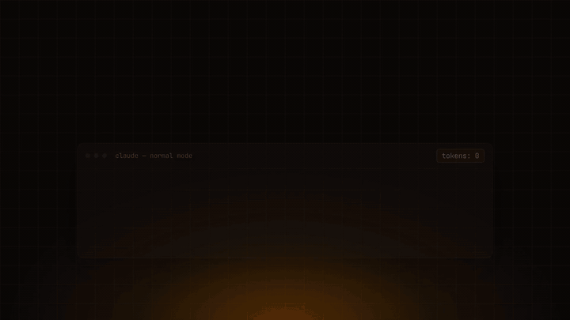

<div align="center">

# 🪓 CAVEMAX

### Claude Code talks too much.
**CAVEMAX makes AI coding agents brutally concise.**

Same code. Same errors. Same identifiers. Less filler.


[](LICENSE)
[](package.json)
[](#install)
<!-- TODO(maintainer): enable once the repo shows up on skills.sh (it is indexed from `npx skills add` installs; the badge URL currently returns "resource not found"):
[](https://skills.sh/Nixus-security/Cavemax-Skills)
-->

</div>

```bash
npx skills add Nixus-security/Cavemax-Skills
```

CAVEMAX is a [Skill](https://skills.sh) for **Claude Code, Cursor, Gemini CLI, Codex** and other AI coding agents. It strips
filler, repetition and redundant prose from the agent's replies — using glyph
notation, a small abbreviation dictionary and telegraphic syntax — while
**preserving code, identifiers, paths, error messages, commands, numbers,
versions, security warnings and destructive-action confirmations**.

Designed for roughly **85–90% fewer output tokens** at the default level. That is a
design target: the one worked example below measured ≈84% (estimated tokens), and a
reproducible benchmark harness is included — see [Benchmark](#benchmark) for what is
and isn't measured yet.

```text
You:  /cavemax max
You:  Why is my /users endpoint slow?

AI:   `/users` slow ∵ N+1. per-user→+1 posts q. 100u=101q.
      fix: eager JOIN→1q · index FK · paginate.
```

## Install

**Recommended — Agent Skills**

```bash
npx skills add Nixus-security/Cavemax-Skills
```

Installs the skill (`skills/cavemax/SKILL.md`) into your agent's skills directory.
Then say "use cavemax", or invoke `/cavemax` where your agent supports skill commands.

**Full installer** — adds the Claude Code per-turn anti-drift hook, statusline badge and
`/cavemax` level switching, and writes native rules for Cursor, Gemini CLI and Codex:

```bash
npx github:Nixus-security/Cavemax-Skills                    # every supported tool
npx github:Nixus-security/Cavemax-Skills --cursor --gemini  # pick tools
npx github:Nixus-security/Cavemax-Skills uninstall --all    # remove everything
```

Restart your agent afterwards. Claude Code starts with CAVEMAX **off** until you run
`/cavemax`. More options (global scope, manual install, clone install, chat apps):
[docs/INSTALL.md](docs/INSTALL.md).

> `npx cavemax` is **not** available yet — the package is not published to npm.

## Demo



*Animated illustration of the example below (scripted, not a live recording). A real-session recording spec is in [assets/README.md](assets/README.md).*

## Before / After

Prompt: *"Why is my `/users` endpoint slow and how do I fix it?"*

**Without CAVEMAX** — 535 chars:
> Sure! Your `/users` endpoint is likely slow because of an N+1 query problem. For each user you fetch from the database, your code makes an additional separate query to load that user's posts. So if you have 100 users, you end up running 101 queries total, which is very inefficient. To fix this, you should use eager loading so all posts are fetched in a single query with a JOIN. You should also add a database index on the foreign key column to speed up lookups. Finally, consider adding pagination so you don't load all users at once.

**With CAVEMAX `max`** — 86 chars:
> `/users` slow ∵ N+1. per-user→+1 posts q. 100u=101q. fix: eager JOIN→1q · index FK · paginate.

**With CAVEMAX `brutal`** — 81 chars:
> `/users` slow: N+1. /user→+1 posts q ∴ 100u=101q. fix: JOIN eager→1q · idx FK · paginate.

| variant | chars | ≈tokens | ≈saved |
|---|---:|---:|---:|
| without CAVEMAX | 535 | 134 | — |
| `max` | 86 | 22 | 84% |
| `brutal` | 81 | 20 | 85% |

**Removed:** the greeting, "likely", "because of … problem", the restated
explanation, "you should", "consider". **Kept, identical:** `/users`, `N+1`, `JOIN`,
`FK`, `100`, `101`, and the three fixes.

> ⚠️ Honest caveats: this is **one illustrative prompt**, the "without" text is
> hand-written, and tokens are estimated as chars ÷ 4 — not measured from a model API.
> Short answers hit a floor; longer explanatory text has more to strip. Don't read
> this table as a benchmark — [docs/BENCHMARKS.md](docs/BENCHMARKS.md) explains how to
> produce one.

## What CAVEMAX preserves

Compression changes how an answer is written, not what must stay exact. These are
always kept verbatim, and the agent drops back to plain prose for them, then resumes:

- **Code blocks** — verbatim
- **Error messages** — quoted exactly
- **Identifiers** — function names, API names, file paths, commands, flags
- **Numbers, units, versions**
- **Security warnings** — full prose
- **Destructive-action confirmations** — `DROP`, delete, force-push, overwrite
- **Order-sensitive sequences** — where dropping conjunctions would flip meaning

This is an instruction to the model, so it is designed to preserve these — it is not a
formal guarantee. The repo ships tests that check the ruleset, hooks and a
preservation checker; see [Development](#development).

## How it works

One ruleset, [`skills/cavemax/SKILL.md`](skills/cavemax/SKILL.md), is the source of truth.

- **Claude Code (full installer):** a `SessionStart` hook and a `UserPromptSubmit`
  hook re-inject the ruleset **every turn**, so the style does not fade as the
  conversation grows. A flag file (`~/.claude/.cavemax-active`) stores the level.
- **Cursor / Gemini CLI / Codex:** the ruleset is written into each tool's always-on
  rules file (`.cursor/rules/cavemax.mdc`, `GEMINI.md`, `AGENTS.md`).
- **Levels:** `safe` · `max` (default) · `brutal` · `mute` (`yes`/`no`/`done`, urgent = one
  sentence). Switch with `/cavemax <level>` or say "cavemax brutal"; "normal mode" turns it off.

Details, hook sequence diagram and levels: [docs/HOW-IT-WORKS.md](docs/HOW-IT-WORKS.md).

### Why not just tell Claude "be concise"?

A one-off "be concise" is a single instruction at the top of the context. After a few
turns, the model tends to slide back into long prose, and "concise" doesn't say *what*
may be cut or what must never be cut. CAVEMAX adds three things:

1. **Persistence** — on Claude Code the rules are re-injected on every prompt by a
   hook; on Cursor/Gemini/Codex they sit in an always-applied rules file.
2. **A precise spec** — what to drop (articles, filler, hedging, restated questions),
   a fixed glyph key and abbreviation dictionary, and levels from `safe` to `mute`.
3. **An explicit accuracy floor** — the list above, with automatic fallback to plain
   prose for security warnings and irreversible actions.

Trade-off: per-turn re-injection adds a few hundred *input* tokens each turn. Output
tokens are usually the larger cost in a long coding session, but measure it for your
workflow. `npx skills add` alone installs the skill **without** the hook, so
persistence there depends on your agent keeping the skill in context.

## Benchmark

| Claim | Status |
|---|---|
| ≈84–85% fewer (estimated) tokens on the `/users` example | Measured once, by hand, chars ÷ 4 — see above |
| ~85–90% at `max`, ~70% `safe`, ~90%+ `brutal`, ~99% `mute` | **Design targets, not measured results** |
| 50-prompt, 7-category baseline-vs-CAVEMAX run | **Harness included, results not published yet** |

The harness is reproducible: [`benchmarks/prompts.json`](benchmarks/prompts.json) (50 fixed
prompts), [`scripts/benchmark.js`](scripts/benchmark.js) (reports token reduction per
category plus a preservation check). Methodology and how to submit a run:
[docs/BENCHMARKS.md](docs/BENCHMARKS.md).

## Supported agents

**Supported** — an integration ships in this repo and its install/uninstall is covered by automated tests (sandboxed; behavior inside each tool is not automated):

| Agent | Installed as | Persistence |
|---|---|---|
| Claude Code | hooks + skill (`~/.cavemax`, `~/.claude/skills/cavemax`, `settings.json`) | per-turn hook |
| Cursor | `.cursor/rules/cavemax.mdc` (`alwaysApply: true`) | always-on rule |
| Gemini CLI | `GEMINI.md` block (project or `~/.gemini`) | always-on context file |
| Codex CLI | `AGENTS.md` block (project or `~/.codex`) | always-on context file |

**Experimental**

- Other agents supported by `npx skills add` — the skill file is installed; not tested per-agent here.
- Chat apps (claude.ai, ChatGPT, Gemini) — paste a condensed prompt into custom instructions: [docs/INSTALL-CHAT.md](docs/INSTALL-CHAT.md). No hooks, so no anti-drift.

## Security & Privacy

Facts verified in this repo's code (details and limits in [SECURITY.md](SECURITY.md)):

- ✅ **Local execution** — installer and hooks are small Node scripts run on your machine.
- ✅ **No telemetry, no network calls** — none of `bin/`, `src/`, `lib/` or `scripts/` makes a network request.
- ✅ **No source-code upload / no API keys collected** — the hooks read only your prompt text on stdin and a one-word flag file.
- ✅ **Careful config handling** — `settings.json` edits are additive, idempotent, and backed up first; flag-file I/O is symlink-safe, size-capped and whitelist-validated.
- ✅ **Zero runtime dependencies** — and open source (MIT).
- ⚠️ Your agent still sends your prompts to its model provider, as it always does; CAVEMAX adds its ruleset to that context.

## Advanced configuration

Make CAVEMAX on from session start (default is off for Claude Code):

- Env: `CAVEMAX_DEFAULT_MODE=max`
- Or `~/.config/cavemax/config.json` (`%APPDATA%\cavemax\config.json` on Windows): `{ "defaultMode": "max" }`

Resolution order: env var → config file → `off`.

## Development

```bash
git clone https://github.com/Nixus-security/Cavemax-Skills.git
cd Cavemax-Skills
npm test            # no dependencies to install
npm run build       # regenerate AGENTS.md / GEMINI.md / CLAUDE.md / .cursor rule from SKILL.md
```

`npm test` checks the SKILL.md frontmatter, the never-compress floor in the ruleset and in
every hook injection, adapter sync, flag-file safety, a sandboxed install/uninstall
round-trip, the preservation checker (including negative fixtures) and link integrity.
It validates the ruleset and tooling — **not** how any specific model behaves.

## Contributing

Issues and PRs welcome. Edit the ruleset only in `skills/cavemax/SKILL.md`, run
`npm run build && npm test`, and keep the accuracy floor intact: no change may let
code, error strings or security warnings be compressed. Benchmark runs on real models
are especially welcome — see [docs/BENCHMARKS.md](docs/BENCHMARKS.md). Security issues:
[SECURITY.md](SECURITY.md). Release notes: [CHANGELOG.md](CHANGELOG.md).

## License

[MIT](LICENSE) © 2026 Nixus-security. Inspired by [caveman](https://github.com/JuliusBrussee/caveman) by Julius Brussee.
