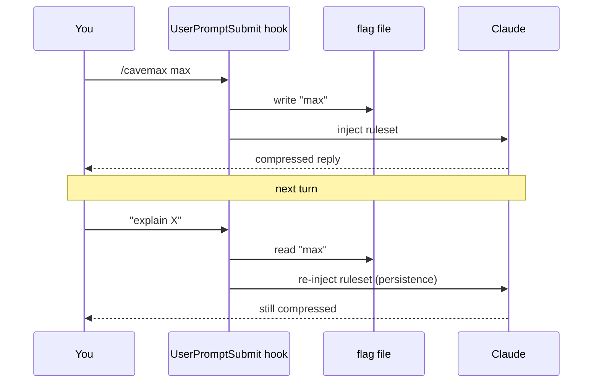

# How it works

## Single source of truth

[`skills/cavemax/SKILL.md`](../skills/cavemax/SKILL.md) holds the ruleset, decoding key, level table and examples.
`npm run build` (`scripts/build-adapters.js` + `lib/ruleset.js`) renders it into `AGENTS.md`, `GEMINI.md`,
`CLAUDE.md`, `.cursor/rules/cavemax.mdc` and `assets/cavemax-chat-prompt.md`. `npm test` fails if any adapter drifts.
The Claude Code hooks read `SKILL.md` at runtime.

## Levels

| Level | What changes | Target* |
|---|---|---|
| `safe` | Drop articles/filler/pleasantries/hedging. Readable. | ~70% |
| `max` (default) | + glyphs, abbreviation dictionary, telegraphic syntax, lists over prose | ~85–90% |
| `brutal` | + near-notation, max density, higher misread risk | ~90%+ |
| `mute` | `yes` / `no` / `done`; urgent = one short sentence | ~99% |

\* Design targets stated in the ruleset, **not measured results**. See [BENCHMARKS.md](BENCHMARKS.md).

## Claude Code path (full installer)

1. **`SessionStart` → `src/hooks/cavemax-activate.js`** resolves the default mode (env var → config file → `off`).
   If `off`, it prints `OK` and stays silent. Otherwise it writes the flag file and injects the ruleset
   filtered to the active level.
2. **`UserPromptSubmit` → `src/hooks/cavemax-tracker.js`** runs on every prompt: parses `/cavemax <level>` and
   natural-language switches ("stop cavemax", "normal mode", "max compression"), updates the flag file, then
   re-injects a short reinforcement of the rules. This is the anti-drift mechanism.
3. **Flag file** `~/.claude/.cavemax-active` holds one whitelisted word (`safe|max|brutal|mute`) or is absent.
   The statusline script (`.ps1` / `.sh`) reads it to show `[CAVEMAX]`.

Flag I/O is symlink-safe (`O_NOFOLLOW`, temp file + rename, mode 0600), size-capped (32 bytes) and
whitelist-validated, so a planted flag cannot inject arbitrary text into your terminal or the model context
([`cavemax-config.js`](../src/hooks/cavemax-config.js)).

Cost note: the per-turn reinforcement is a few hundred input tokens per prompt.

## Cursor / Gemini CLI / Codex

No hooks are used. The ruleset is written into the tool's always-on rules/context file inside
`<!-- CAVEMAX:START … -->` / `<!-- CAVEMAX:END -->` markers, so install is repeatable and uninstall removes only
that block. The rule is always on at `max`; switch level by saying "cavemax safe" / "cavemax brutal" /
"cavemax mute" / "normal mode".

## Agent Skills path

`npx skills add` copies only `skills/cavemax/`. There is no hook, so the skill relies on the agent loading it
(the `description` in the frontmatter is the trigger text) and keeping it in context.

## Relationship to caveman

CAVEMAX is an independent successor-in-spirit to [caveman](https://github.com/JuliusBrussee/caveman): same idea
(persistent terse mode with an accuracy floor), pushed further with glyph notation, an abbreviation dictionary and
telegraphic syntax. It uses its own flag file and does not touch a caveman install, but running both at once
injects two style modes — turn one off first.
